# Software Tools - Get Started

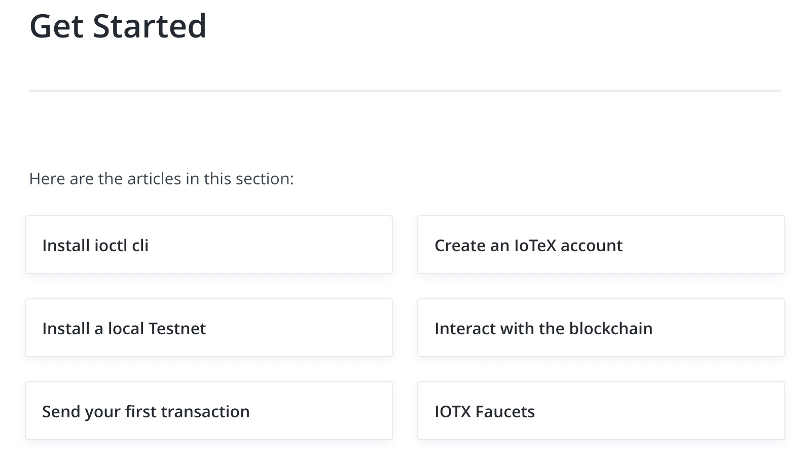

This section is nicely linked, but I think a more narrative approach would be more effective. I think the links are great and useful for a user that already has a clear idea of what they want to do and why, but I think the quick Get Started example should hold the users' hand even more than this the whole way, and clearly outline why each step will be necessary.

So I think a good approach here would be to build something specific and straightforward and walk the user very clearly through the entire process to keep things more grounded and concrete. From there, I think it would be better to clearly explain why one needs to install the **ioctl cli**, then **create an account**, then **install a local testnet**, then **interact with the blockchain**, etc... Each step is necessary and serves a specific purpose, so it would be good to create a quick overview with a sentence or two detailing why each is necessary before the user actually gets started. I think it could help add clarity to the actual order of operations to have a quick explainer as well as a concrete easy project that users can ground themselves on as they work through the Get Started quickstart example.

## Install ioctl cli

Some important notes on this one: <https://docs.iotex.io/software-tools/get-started/install-ioctl-cli>

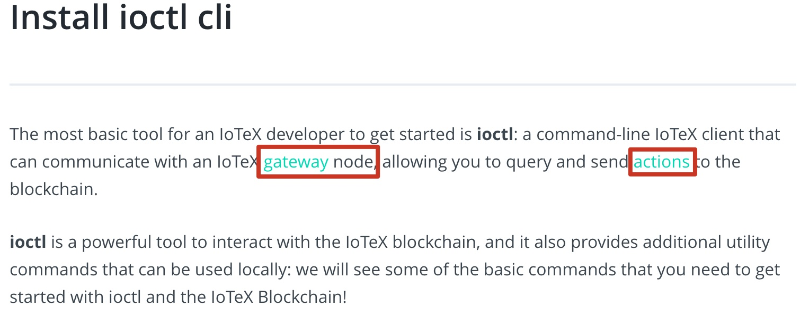{width="800"}

Here you introduce the IoTeX ***gateway*** node, and you explain that it allows users to query and send ***actions*** to the blockchain, but I don't like how it links to that information separately. I believe here you should actually explain what a gateway and what an action is directly rather than linking to the definition separately. And, **very importantly**, these hyperlinks are **BROKEN** and need fixing:

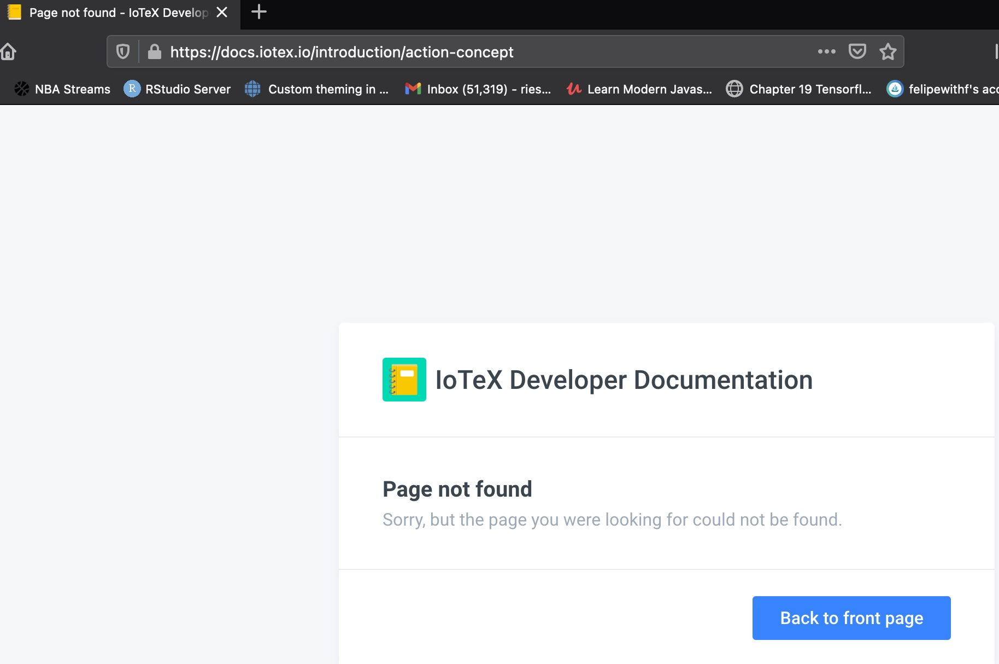{width="700"}

As of 05/27, the following two links are **both broken**:

-   <https://docs.iotex.io/introduction/node-concept>

-   <https://docs.iotex.io/introduction/action-concept>

### Usage

The installation does not seem to work on my MacBook Air (M1, 2021) because of its arm64 architecture:

{width="700"}

In my opinion it's going to present a challenge to a lot of people the fact that this won't work on any new Mac products since late 2020 on the M1 chip. For real adoption would be better to have more options than just Linux.

I also think the link to the reference for the cli is useful, but having it right below the step makes it seem like the next step. When going through this, I instinctively clicked on that link for the next chapter but was brought to the middle of nowhere in the references and was confusing:

{width="700"}

<!-- ### Next Steps -->

<!-- I wish I could document my experience with the steps from ***Create an IoTeX account*** to ***IOTX Faucets***, but unfortunately the ioctl cli installation does not seem to work on my M1 MacBook Air right now. I will have access to a windows computer again on May 29th and I would gladly give it another go and document my experience here as well. For now adding details for the sections where I am able to. -->

#### Linux install

On Linux the installation worked as expected: 

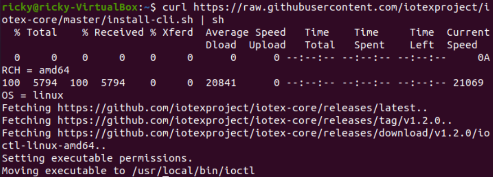

## Create an IoTeX account

Broken hyperlinks circled below:

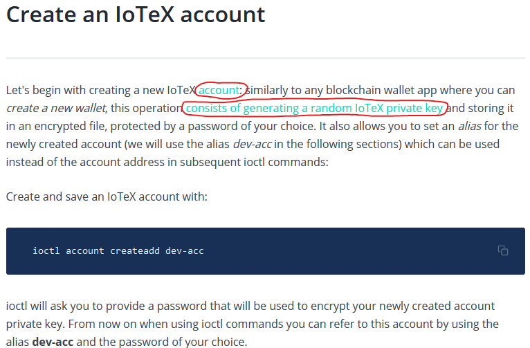

This command is supposed to prompt me to choose a password, but nothing seems to happen on my end:

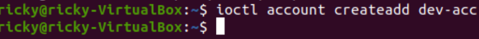

I watched the video embedded at the bottom of the page ***An introductory video to ioctl accounts management*** and followed the steps as shown.

Running `ioctl account create`, still doesn't return anything:
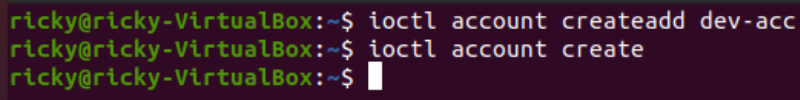

I also think it's odd that the video overview walks people how to do it on Windows, but according to the documentations this does not currently work on Windows. I tried the steps in the video and I can confirm it does not work on Windows and powershell:

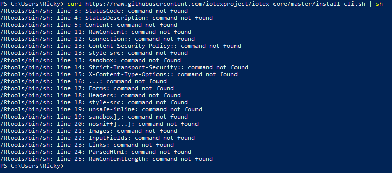

The video is really good, but no commands seem to work on my end, but I see nothing:

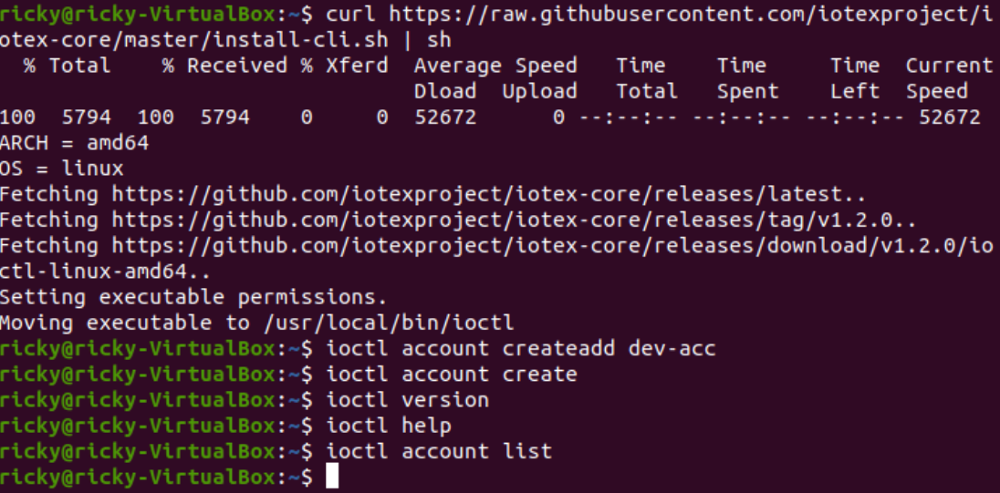

## Install a local Testnet

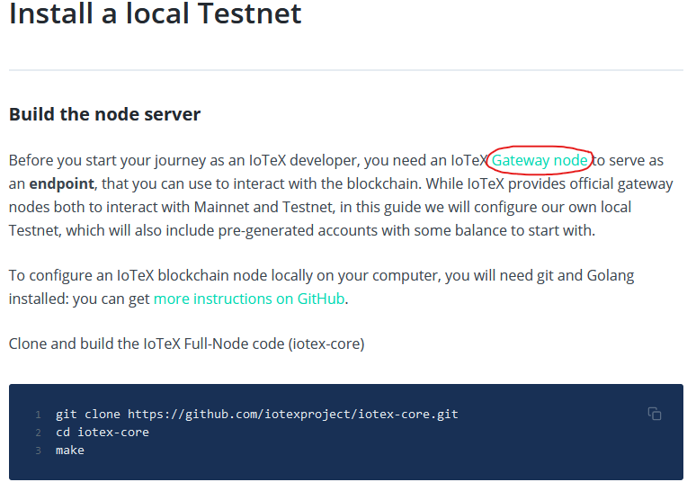

The link to the ***Gateway node*** circled above is broken.

Following the commands in this section, this is what I get:

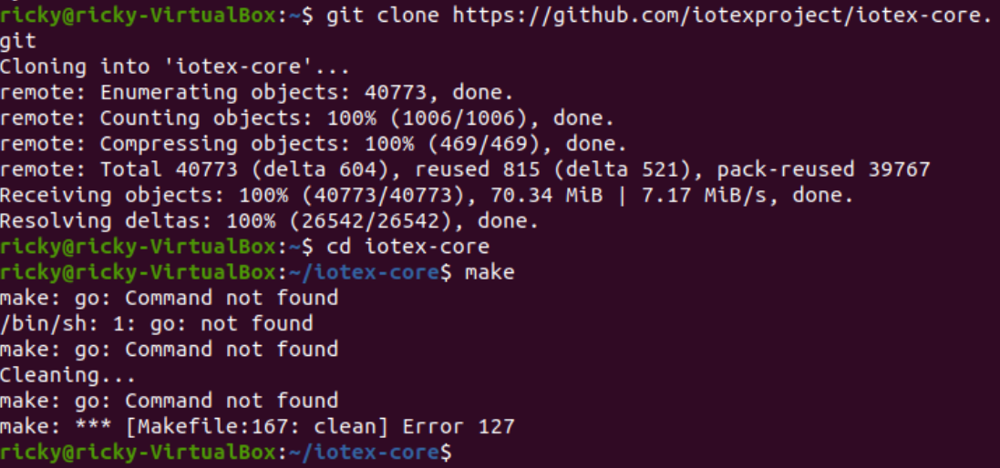

After understanding the error I figured I did not have golang installed on my machine. I was able to resolve the issue by installing golang with `sudo apt install golang`. After running this command I no longer get the previous error, but **it still does not work**:

Looking through the GitHub repository, I noticed that golang was listed as a dependency, and so was Protoc:

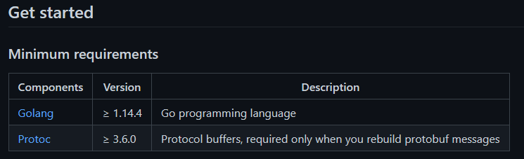

After a bit of digging I found the `sudo apt install protobuf-compiler` worked to install the other component I was missing. I think the error shown in the previous screenshot ***cannot find module for path .*** could be more clear to instruct the user on what is missing and how to install the missing component.

This time it ran for much longer and I got a different error:

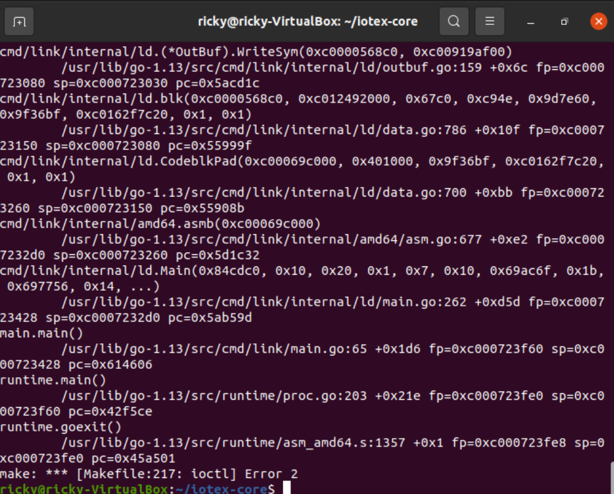

So this time I figured there was some kind of issue with ioctl since my commands were not functioning as expected. After a lot of experimentation I figured out that I needed to set an endpoint, and the commands like `ioctl version` started finally working:

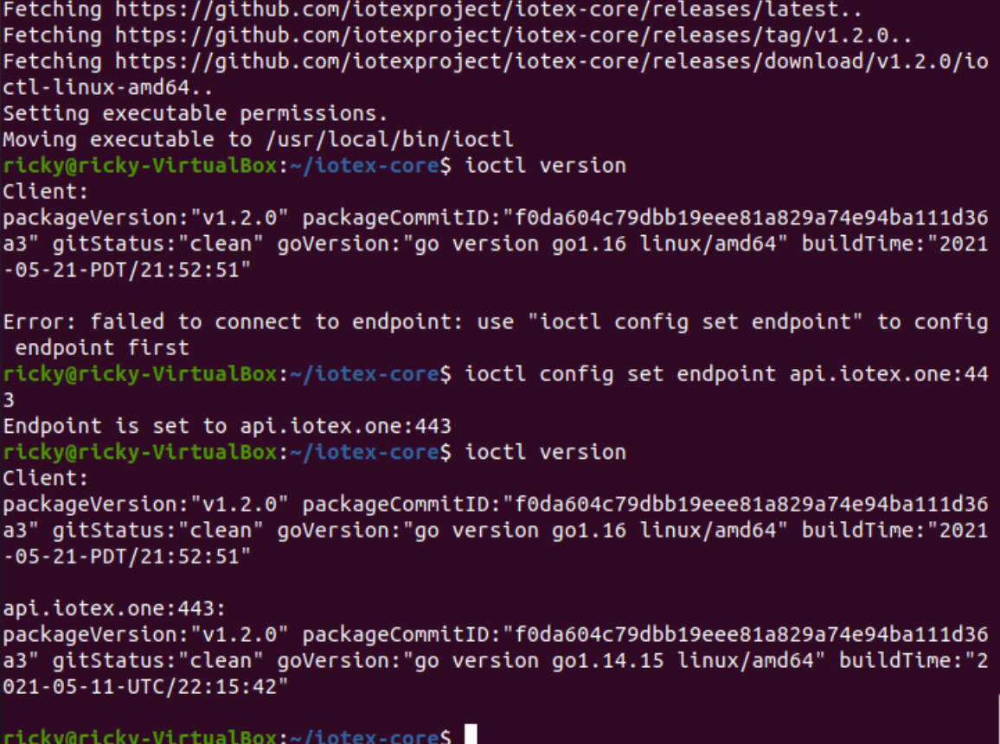

So **finally** I was able to follow along with the tutorial step of `ioctl account createadd dev-acc`

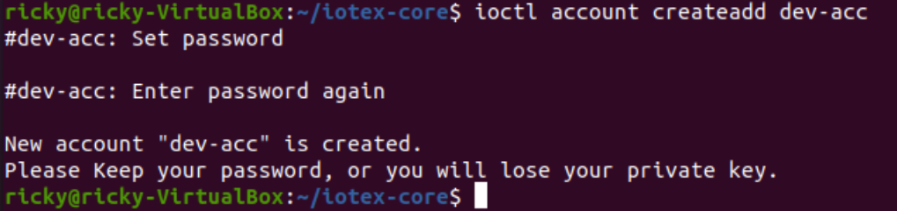

And all the commands that weren't doing anying before now seem to work as expected:

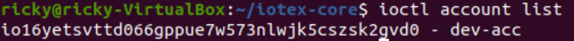

This time, when I run the `make` command, ***yet another error***:

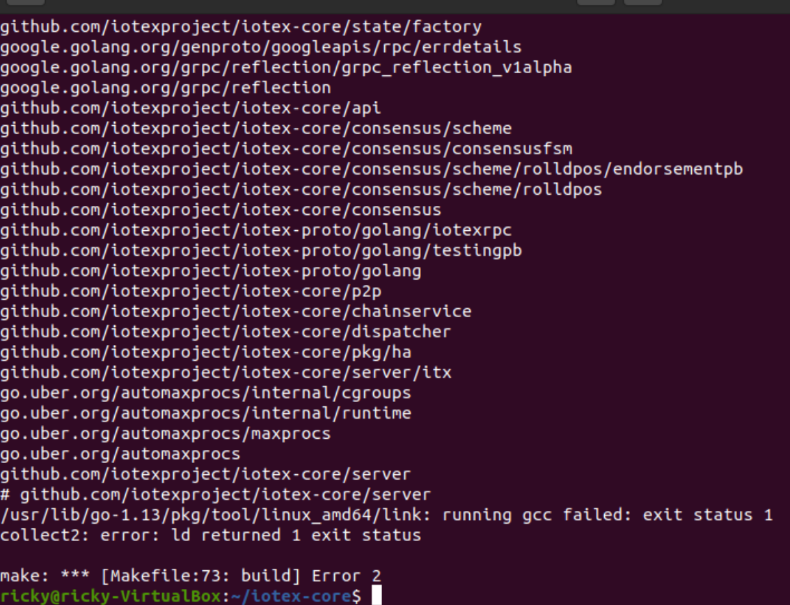

Here is the best explanation I was able to find for this error:

At this point I called it quits, way too many errors, the [step of ***Install ioctl cli***](https://docs.iotex.io/software-tools/get-started/install-ioctl-cli) for sure needs some more work in my opinion. See section below.

## Feedback - User Experience

This section was a bad experience on my end. Took me several hours to just run to create the account through ioctl. Two things that would have saved me all that time:

1. Make the dependencies of Go and Protoc more obvious, and provide users with the installation commands for both as part of the tutorial (highlighted as an optional task if the user already has them installed).

2. The tutorial ***NEEDS*** the command `ioctl config set endpoint api.iotex.one:443` in order to work. Without this step, on my end nothing was working at all, and worse it was just not returning any message at all, so it's impossible to debug.

3. More specific errors are needed. If you don't have a specific dependency of either Go or Protoc installed, the terminal should explicitly say so instead of returning a more ambiguous message. Only so much can be missing on the user's end, so it would be better to catch those specific circumstances.

## Interact with the blockchain

I tried following the rest of the steps, but because of the issue outlined up to this point, I was not able to follow along with the rest of the steps:

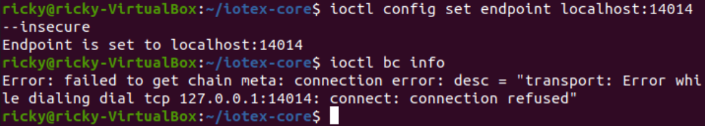

## IOTX Faucets

This step was a bit odd on my end. On my MacBook I ran into issues on both Chrome and Firefox and the Google login works great, but when I click "Submit", something was going wrong there. See error in top right corner here:

Doing it through my Linux environment on Firefox two days later worked great:

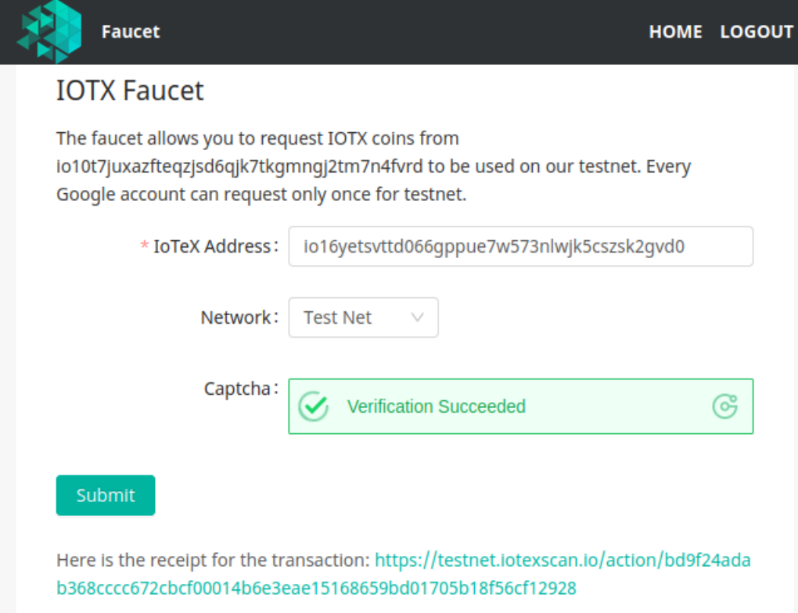

And the transaction hash and everything here looks great and correct:

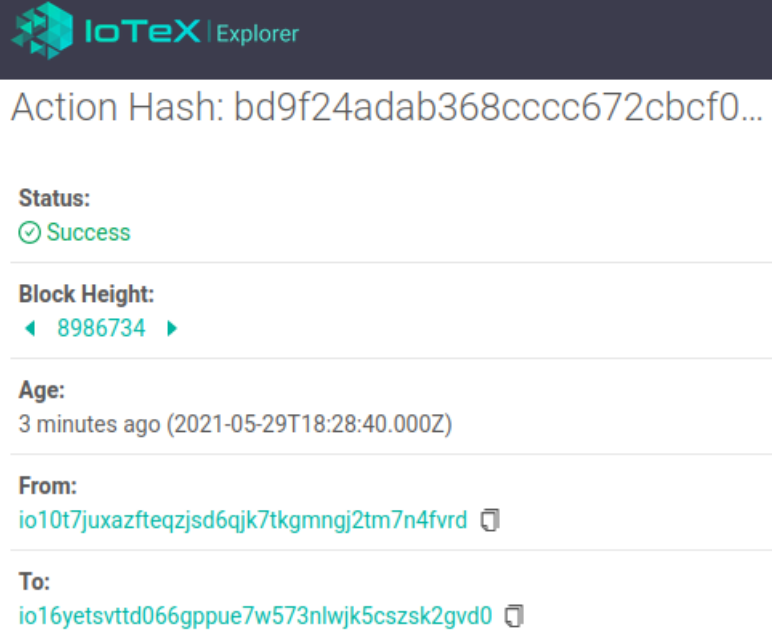

#### Note

One more quick observation here too is that faucet.iotex.io does not automatically redirect a user to https://faucet.iotex.io which I think would be good practice:

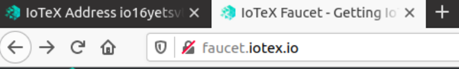

