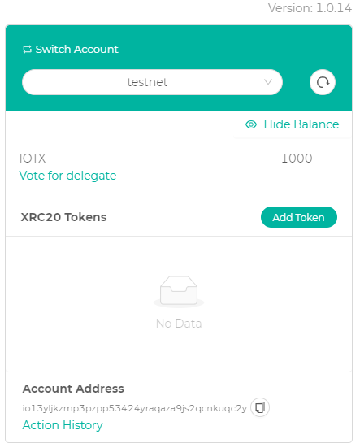
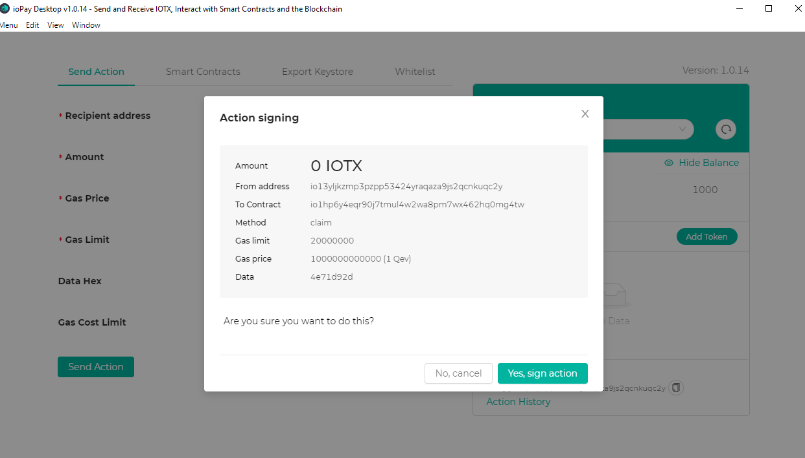

# Smart Contracts

## Introduction

Here might be good to give a really basic understanding of what the EVM is, or at least link to a resource for users to learn more.

### Solidity Programming Language

Some great links in here and none of them are broken, so all good on that front. One thing that caused some confusion for me was the sentence ***"compliant with Solidity syntax, up to its latest release."***. Does this mean it's compliant up to the current latest release (which one?), or does it mean that it will ***always*** be compliant with the latest release of Solidity?

The one thing that stands out to me here is that there isn't a very strong introduction around smart contracts, what they actually do, and why they are important. I think just one or two sentences around a smart contract being a way to trust that a protocol will work the way its supposed to work and a quick comparison between this mechanism and how traditional companies work would be really helpful here before you start talking about the specifics of solidity. Might also be worth verbalizing better the connection between the EVM and the Solidity language, and how other smart contract languages exist too.

### Advantages of IoTeX Smart Contracts

This section is informative, but I think it should have a link/resource added to it around ***Roll-DPoS*** and how that functions, I think that would be more relevant than the tokenomics link. I think it's a fundamentally important point to understand to truly grasp how you get to 5-second confirmation time, instant finality, and close to $0 transaction fees. And I think it would really drive your point home of why the IoTeX blockchain is the perfect environment for deploying smart contracts that will be used in real-world applications. But really cool that IoTeX smart contracts are backward compatible with the EVM.

## Issue XRC20 Tokens on IoTeX

One first observation for this section is that the link goes to http://iopay.iotex.io/desktop/ when https://iopay.iotex.io/desktop/ seems like the better option.

Here I was not able to download on Linux, so I moved to run the IoTeX Desktop Wallet from Windows instead. I was able to repeat the steps on Windows and get funds on the Test Net inside my desktop wallet:

### Edit Solidity code in IoTeX Studio IDE

I tried doing the steps outlined for ide.iotex.io, but when I click on ***Compile Contract*** absolutely nothing is happening (on either environment of Javascript VM or deploy via ioPay). No clue what I am doing wrong:

I tried from Mac, Windows, and Linux and could not get it to work on any of them. Here is an example trying from Windows deploying the smart contract to the ioPay Desktop environment:

No clue what I'm doing wrong here. But in terms of feedback I think the code in step 2 could optionally be explained in more detail. One idea would be to explain what each step does in more detail through some type of other separate link and be able to dig into each step (like understanding the functionality of each of the three import statements one by one). The code in the documentation looks good, but the code linked on GitHub looks a bit off in terms of having the import link to the proper url and not sure if it's importing from its own repository or something:

Overall though I think the steps as they are outlined are very logical and clear for this section, and it makes sense.

### Note

As shown in the short videos embedded above, nothing was happening in the ioPay Desktop app. About an hour later though I noticed that I did have a prompt that ***eventually*** showed up:

But I didn't have the website open anymore because it had been a long time, and when I went back to ide.iotex.io I was not able to find the compiled contract as shown in the last step of ***3. Build and Deploy***.

## Token Metadata

This section is clear, but I think the metadata itself could be discussed more. I would almost like to see the JSON example from the GitHub repository be added into the official docs and have more of a discussion around what each one represents so people can get a better understanding of what to change and when. I think most people would figure out to change most of these, but would be great to give more details around the ***type*** (xrc20 vs. xrc721 and linking to good resources that give a good comparison of the two token standards), as well as the ***decimals*** and maybe giving a simple example of choosing one option over another on those two.

But the [GitHub repository](https://github.com/iotexproject/iotex-token-metadata#iotex-token-metadata) is really great and the ***New token submission process*** is very clearly outlined and I have no questions around that process, seems straightforward. The only question that comes to mind here is if one could have their token arbitrarily be rejected (outside of established guidelines). I also really like the code for the ***Usage*** section and how it's way simple code, that's awesome.

