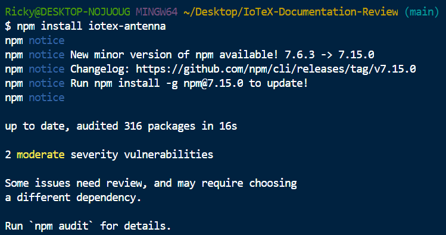

# iotex-antenna SDK

Good links here, but the link to ***Examples*** still appears to be empty:

## Overview

Good informative overview. All links are functional. For the ***Reference implementation*** link might be good to bring to the ***Reference code*** section/homepage rather than the ***Create an account*** page specifically.

## Installation

I followed the instructions for Antenna JS and did not run into problems on install:

For this section I think it would be good if the "Next" button pointed to the actual next steps the user should take with the antenna SDK, bringing the user to the examples pace would be good.

