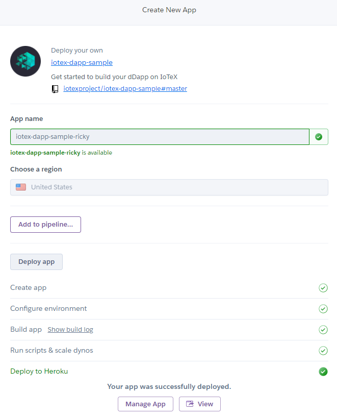
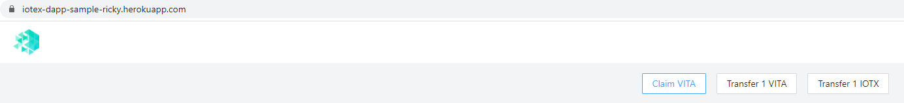

# IoTeX dapp starter

## Deploy on Heroku

Did not run into any issues when deploying to Heroku. Had never used it and made an account and worked really well out of the box just pressing the button and following the prompt:

So no issues at all to get to the working dApp:

The only thing I'm not sure of is where one can find the actual files that make everything work behind the scenes, but it's all available on the [GitHub repository](https://github.com/iotexproject/iotex-dapp-sample) so that works well.

For this part: 

This is really awesome, but would be even more awesome and functional if each of these linked to a high-level explainer, even if that explainer just re-directs to other pieces of the documentation where those topics were discussed.

