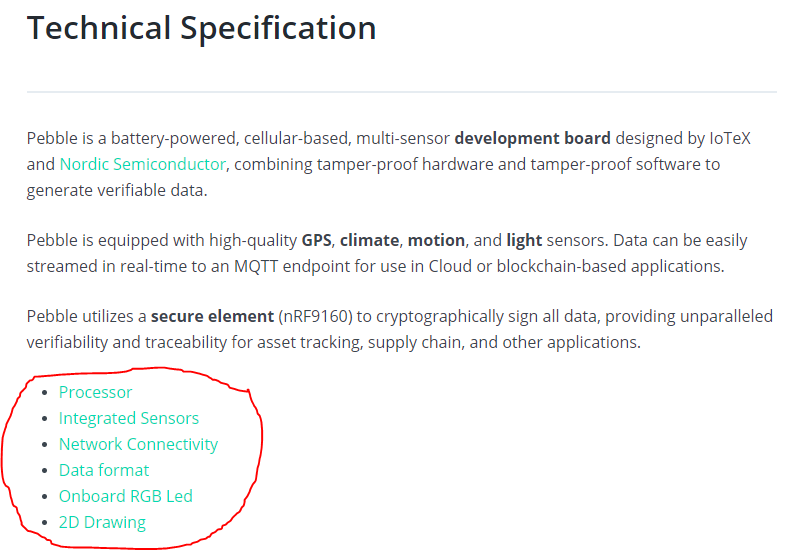
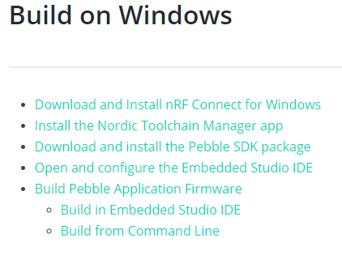
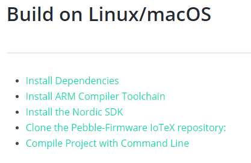
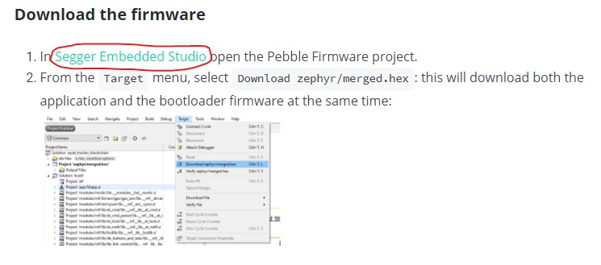

# Pebble Tracker

## Quick Start

I don't own the device so I can't give a review of the quick-start example, but I absolutely **love** this page. This is such an impressive/awesome device, I might have to actually pre-order one for myself. I watched some videos about it, and I don't really have any feedback for this section, it's really clear and the dashboard is really clear and impressive.

## Technical Specification

None of these links work:

Outside of that this page is great, I love how it outlines each sensor with a link to the manufaturer, as well as having details around the accuracy of each one, really nice. No complaints here.

## Hardware Setup

Informative section, nicely polished and great labeled images of the device.

The only link that seems to be broken here is the AT&T link:

## Setup Modes

No broken links here. Helpful overview of the difference between the two modes, but would be great to learn more about the specifics around TLS protecting the communications. But makes sense on when you should use the different tech stacks.

I reviewed the instructions for both the Development mode and the Production mode, and I did not find any broken links in these sections. These sets of instructions here are really impressive! Really thorough, well explained, and walks you through the whole step-by-step process, I don't have any feedback on these ones, they look good.

## Develop and Build the Firmware

### Build on Windows

All of these links appear to be broken currently:

All other links on this page are good. These instructions make sense and there are a lot of screenshots and it's pretty thorough, so this one looks pretty good too.

### Build on Linux/macOS

These links also appear to be broken:

## Configure the firmware

No comments/feedback for this section

## Application firmware

No broken links, informative and well put together section.

## Bootloader firmware

All good on this section with the exception of this broken link for ***Download the firmware***:

