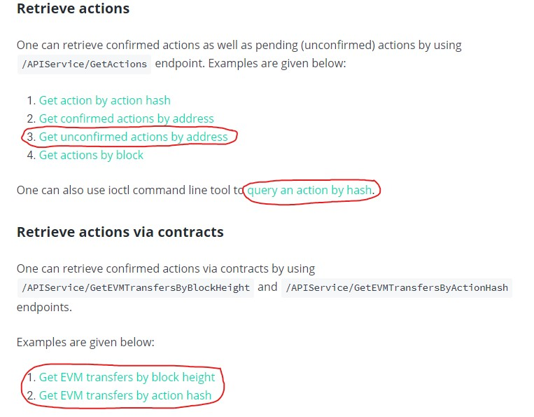
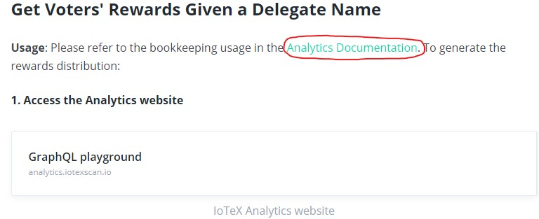
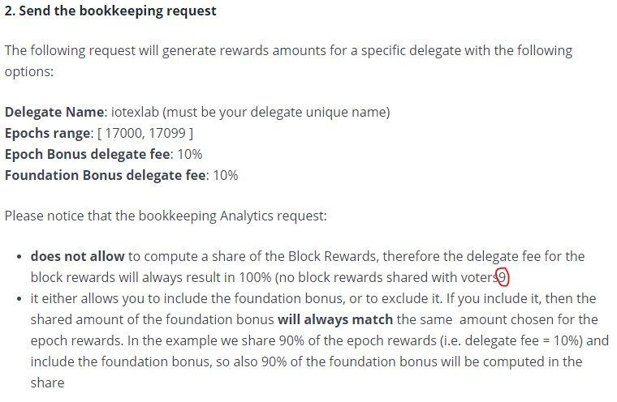

# More Resources

## Exchange Integration - General Guide

Broken links highlighted below:

All other links seem good. Cool that there is documentation out there for the exchanges to understand how to integrate with the IoTeX blockchain.

## Exchange Integration - Rosetta API

This one seems all good, no broken links.

## Action Injector

Really cool that one can simulate random action traffic, impressive feature.

However, this **command does not work**. Tried on both Windows and Linux and it failed on both.

## Hermes

Cool and makes sense here. Might be useful to link to a good resource that discusses Roll-Delegated Proof of Stake consensus.

## Analytics Bookkeeping

This link is pointless because it links to itself so nothing happens:

This is a really tiny typo, but pointing it out anyway; missing a closing parenthesis here:

